# Hank The Hanging Man

[Click here to view the live project](https://hank-the-hanging-man-8f469cffdce1.herokuapp.com)

## Introduction

Hank The Hanging Man is a game made for educational purposes for my third portfolio project in software development that I am studying with the [Code Institute](https://www.codeinstitute.net/). It is aimed at people who want to have fun, test their knowledge, and also train their brain.

The project is generally a game of hangman but to make the game more interesting and appealing than the typical game of hangman people are used to playing, I added a story narrative to enhance the users experience. While designing this game I wanted my target audience to be users of all levels of intelligence so I added three different difficulty levels so that every user could have an enjoyable experience without finding the game either too challenging, or too easy. I wanted to also create a game that the user would want to return to, and play again so I designed it in a way that some of the statements would change every time the game is played to avoid repetition. 

I have applied the the technologies I have learnt so far in python to create my game. Other technologies used are listed in the technologies used section further down the page.

## UX

I wanted to make a game of hangman which will be played on the command line. I wanted to try to make the game a bit more interesting that the average hangman game by creating a story narrative to engage the user. This story consists of an introduction, and various messages that are displayed at certain points through the game depending on how many lives the user has left. These messages are taken from a list in a separate file and consist of multiple messages and only one is displayed at random to the user. I did this so the messages would vary each time the game is played so the user will not find the messages repetitive and will make the game more repayable. To further make the game more repayable I also added three different difficulties each consisting of 50 words. I added an extra feature to the easy difficulty which means the user will not lose a life if they guess a word of an incorrect length just to make the easy difficulty a lot easier than the other two.

I designed the game to consist of various sections which are displayed in a certain order to the user. After the user enters the desired input the terminal clears before displaying the next section. I did this so the terminal would not get cluttered and only display the relevant content for each section without the content from the last section still being displayed above. 

### Colour Palette

With this being a command line game, the main game area consisted of black and white. The template provided to me by [Code Institute](https://www.codeinstitute.net/) placed this game area on a white background and added a orange run program button at the top of the game. 

To make my game more visually appealing I installed the external module [Colorama](https://pypi.org/project/colorama/) to add colour to my print statements. I wanted to do this to help the user have a more enjoyable experience than they would on the standard black and white terminal.  I also did this to emphasise to the user whether the answer they gave was correct or incorrect. 

I used the colour green to highlight various parts of my correct statements including the letter or word guessed, and the users name. By also highlighting the name I felt that it was directly congratulating them to engage them. 

For my incorrect statements I used red to highlight the letter or word guessed and the users name. Again by highlighting their name in red I felt It was more engaging and directly emphasising that they were wrong. I also used the colour red for my invalid statements to emphasise that the input entered was not correct. 

I also added colour to the difficulty narratives. I used green for easy, cyan for medium, and red for hard. 

I used [Coolers](https://coolors.co/ffffff-2ed1d1-83d932-e84610-ed2828-000000) to use their colour pick tool to create a palette of the various colours used throughout the game, and also the colours used in the template provided to me by the [Code Institute](https://www.codeinstitute.net/).

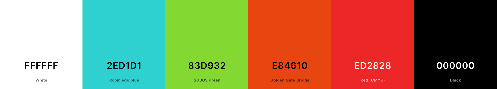

### Contrast Grid

I used [Contrast Grid Eight Shapes](https://contrast-grid.eightshapes.com/?version=1.1.0&background-colors=&foreground-colors=%2383D932%0D%0A%23ED2828%0D%0A%23E84610%0D%0A%232ED1D1%0D%0A%23000000%0D%0A%23FFFFFF&es-color-form__tile-size=compact&es-color-form__show-contrast=aaa&es-color-form__show-contrast=aa&es-color-form__show-contrast=aa18&es-color-form__show-contrast=dnp) to check that all of the colours I had chosen from the [Colorama](https://pypi.org/project/colorama/) module were a good contrast to the black game background. 

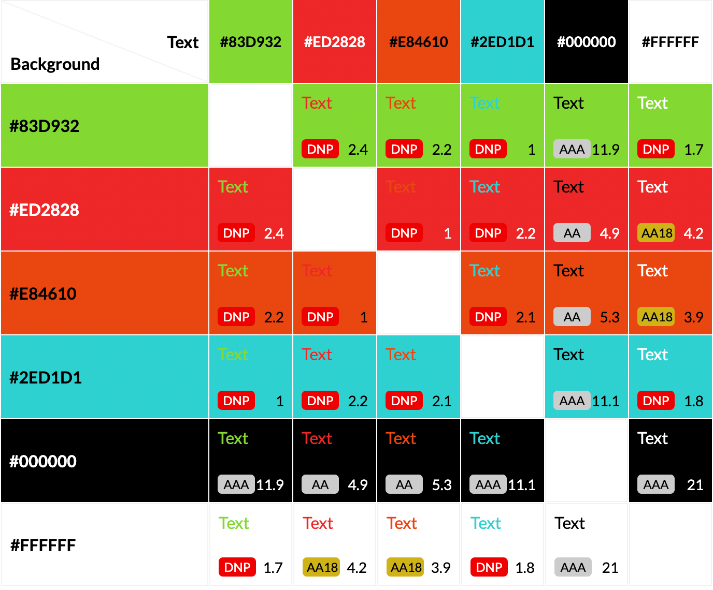

## User Stories

### New Site Users

- As a new site user, I would like to play a game, so that I can relax.
- As a new site user, I would like to see colours in the game, so that I can feel positive emotions while playing.
- As a new site user, I would like to feel engaged in the game, so that I can escape from real life.
- As a new site user, I would like to see the rules, so that I can understand how the game works.
- As a new site user, I would like to easily navigate the game, so that I can replay the game or select a different difficulty.
- As a new site user, I would like to see interesting images, so that I find the game visually appealing.
- As a new site user, I would like to see if my answer is correct or not, so that I can clearly see how I am doing.

### Returning Site Users

- As a returning site user, I would like to have different difficulties available, so that I can challenge myself.
- As a returning site user, I would like to have a lot of game words available, so that I can replay the game without too many repeated words.
- As a returning site user, I would like to see different narratives display each time I play, so that I don't find the game repetitive.

### Site Administrator Goals

- As a site administrator, I should be able to provide a fun and engaging game, so that I can make the users have a happy experience.
- As a site administrator, I should be able to provide multiple difficulties, so that I can encourage the user to return to play again.
- As a site administrator, I should be able to provide more words than are used during one game, so that I can get the user to return to play again.
- As a site administrator, I should be able to provide a diverse game that can be played by all age groups, so that I can reach a wider audience.

## Features

### Existing Features

- **Welcome Section**

    - The first section the welcome section. In this section the user is asked for their name. This is then returned to the user throughout various messages in the game to engage them and talk directly to the user to give them a more personal experience.

| Welcome | Name Input |
| --- | --- |
| 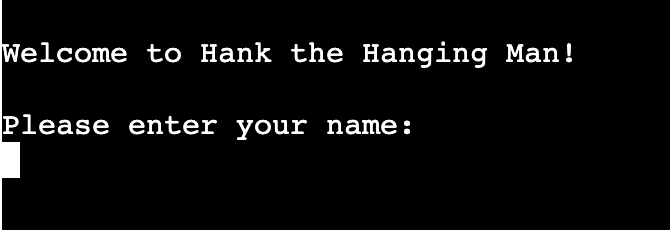 | 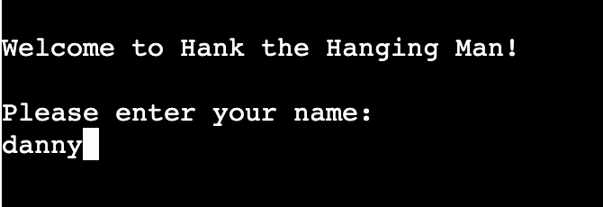 |

- **How To Section**

    - The next section is the how to play, which asks the user if they would like to view the instructions. If they select yes then the instructions will be displayed. If they select no then they will be taken straight to the introduction where the story narrative is displayed. 

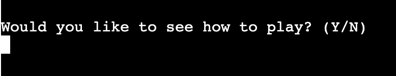

- **Instructions Section**

    - In the instructions section the user is presented with the instructions on how the game is played, so that they can get the most out of their experience.

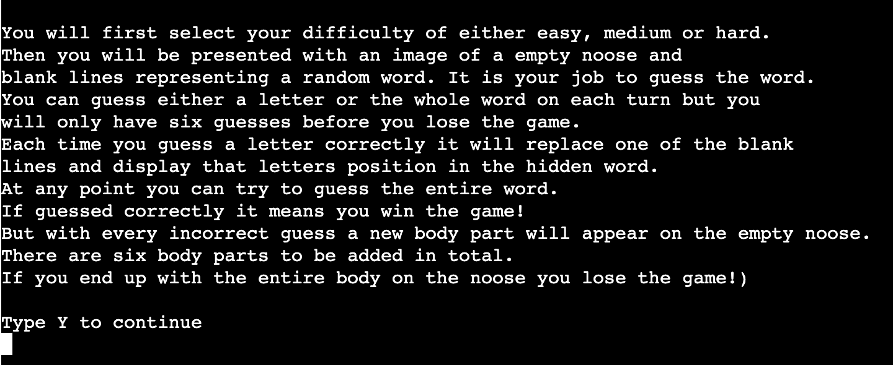

- **Introduction Section**

    - The introduction section is where the user is presented with the story narrative. I did this to give the user a more interesting experience than just playing a simple game of hangman, and with the story of saving Hank it almost makes the user feel as though they have something more to play for. 
    - In this section I also made sure to return the users name when asking them a question so as to directly make them feel more involved.
    - Also in this section I added an option for the user to quit the game, so as to improve the users navigation experience.

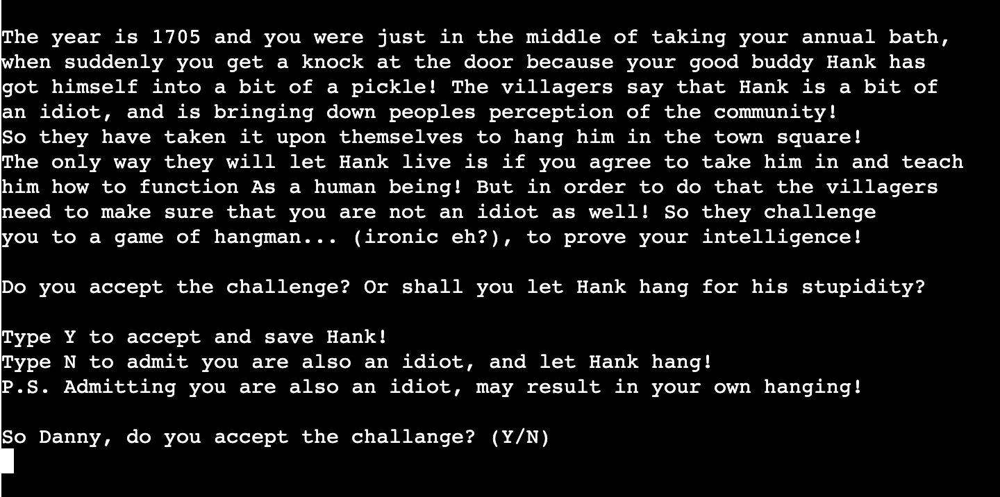

- **Select Difficulty Section**

    - Here in the select difficulty section the user can choose to either select a difficulty or quit the game. I added this section and the various difficulties so the game would be more repayable and suitable for users of all ages and intelligence levels to make the game more diverse and target a broader audience.

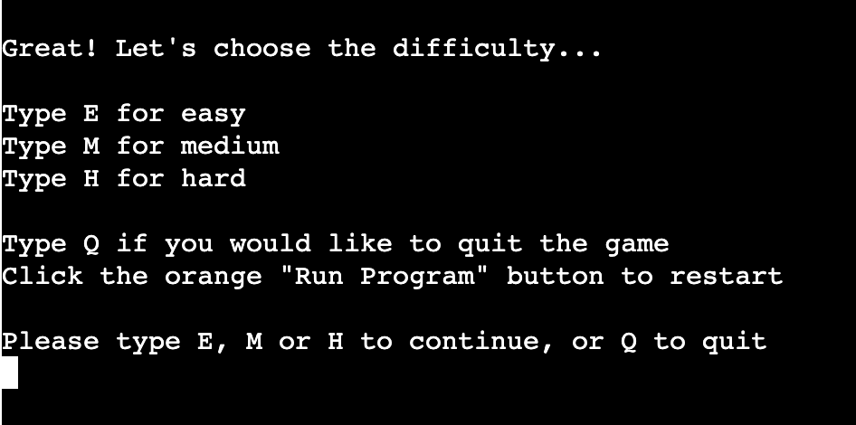

- **Difficulty Narratives**

    - When a difficulty is selected there will be another story narrative displayed with the first line returning the difficulty the user clicked on highlighted in a corresponding colour. I chose for the easy difficulty to be green because its commonly associated as an easy colour. I wanted a more neutral colour for the medium difficulty to emphasise that it is almost the middle difficulty so I chose cyan. For the hard difficulty I chose red as that is commonly associated with being hard. 
    - I also wanted to make the statements more visually appealing so also added an associated emoji that reflects to the narrative displayed so the user will have a more visually appealing experience. 

| Difficulty | Screenshot |
| --- | --- |
| Easy | 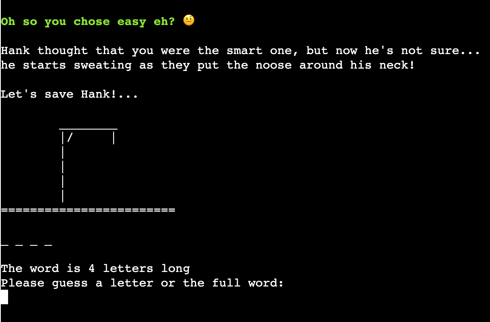 |
| Medium | 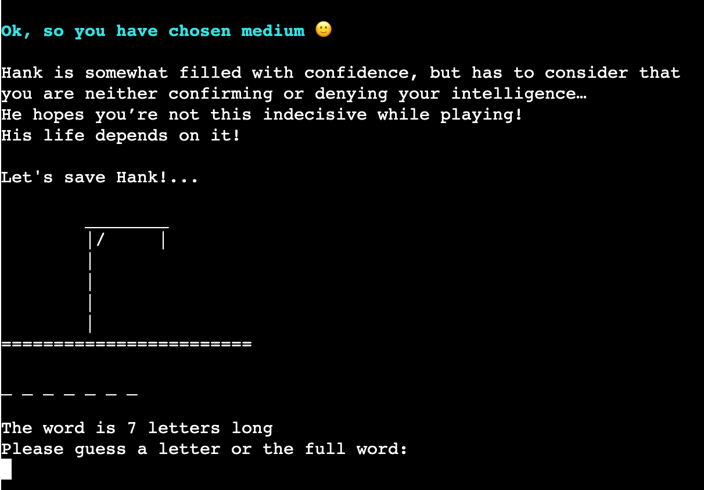 | 
| Hard | 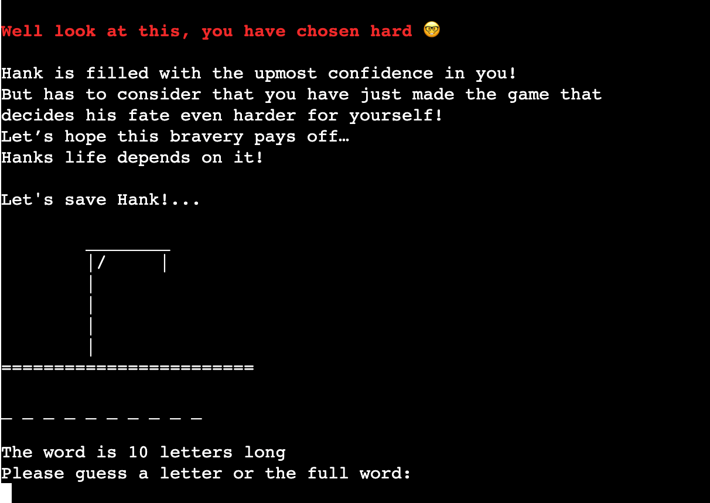 |  

- **Easy Difficulty Invalid Guess Length**

    - Considering I want the game to be diverse and appeal to users of all ages I decided to make the easy difficulty even easier by changing how the game reacts to a word guess of an incorrect length. On the medium and hard difficulties if the user guesses a word of an incorrect length they will lose a life. But to make this difficulty a bit more user friendly to younger age groups I added an invalid statement which instead of losing a life will display a message explaining to the user that the length was incorrect. The statement tells the user how long their guess was and also how long the answer is. 

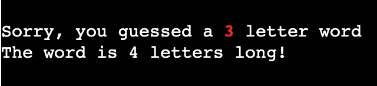

- **Game Image**

    - I wanted to make my hangman images a bit different than usual. So I decided to use emojis for the head. I wanted to emphasise what stage the user was up to so by using emojis I started off with only a slightly worried emoji. This then gets more worried and alarmed as the game goes on until finally a skull emoji is used to emphasise to the user that they have killed Hank. 

| Phase | Screenshot |
| --- | --- |
| One | 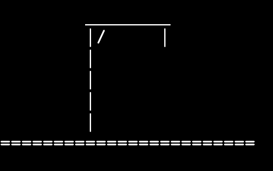 | 
| Two | 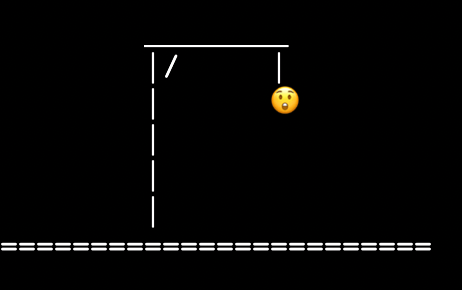 |
| Three | 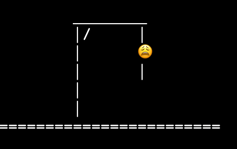 |
| Four | 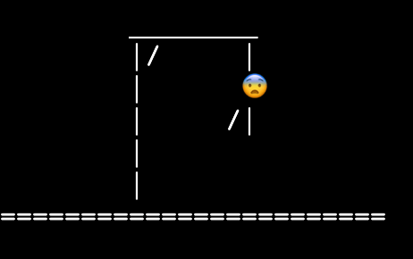 |
| Five | 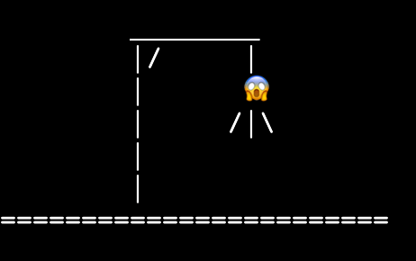 |
| Six | 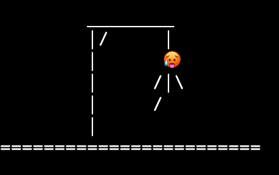 |
| Seven | 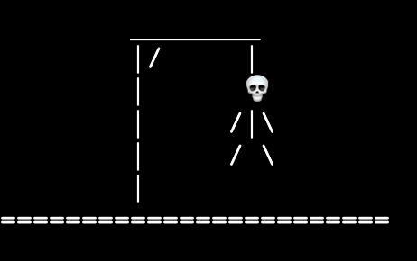 |

- **Hidden Word**

    - I used the built in random module to generate a random word from one of the lists of words i had made for each difficulty. Then I wanted to hide the words by displaying a `_` instead of the letter and add a space between them to make the amount of letters clearer. When the user guesses a correct answer the `_` is then replaced by the correct letter in the position it occurs in the word. 

| Hidden Word | Letters In Word |
| --- | --- |
|  |  |

- **Correct Guess**

    - I wanted to further portray to the user when they had got an answer correct. I did this by the use of colour in my statements. For the correct statements I highlighted the guess in green and also the users name where applicable.

| Letter Guess | Word Guess |
| --- | --- |
|  | 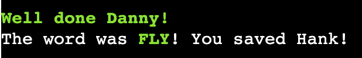 |

- **Incorrect Guess**

    - I wanted to further portray to the user when they had got an answer incorrect. I did this by the use of colour in my statements. For the incorrect statements I highlighted the guess in red and also the users name where applicable.

| Letter Guess | Word Guess |
| --- | --- |
| 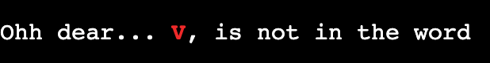 | 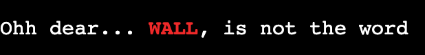 |

- **Letters Guessed**

    - I wanted to display to the user the letters that they had already guessed. I did this so they could hopefully make a more accurate guess at the word, but also to avoid them constantly entering duplicate entries and having to view the statement I added to handle duplicate inputs. 

- **Word Length**

    - With the words being of varying lengths rather than making the user count the amount of blank letters I decided to display to the user how many letters was in the word. I did this to improve the users experience and also to increase the chance of the user returning because it would eliminate the frustration of having to count the blank lines every time. 

- **Random Narratives**

    - To enhance the users experience I added in a story narrative at certain points throughout the game. I Added these narratives for when the user has 4 lives left, 2 lives left, 1 life left, and 0 lives left. I did this to make the game more enjoyable with witty lines popping up to amuse the user. 
    - To make the game more repayable and to entice the user to return, I made these statements random by creating a list of narratives for each stage of lives left and then using the program to randomly select one to display. I did this so the user wouldn’t get bored of seeing the same statements each time the game was played.

| Phase | Screenshot |
| --- | --- |
| Three | 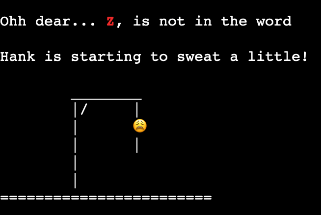 |
| Five | 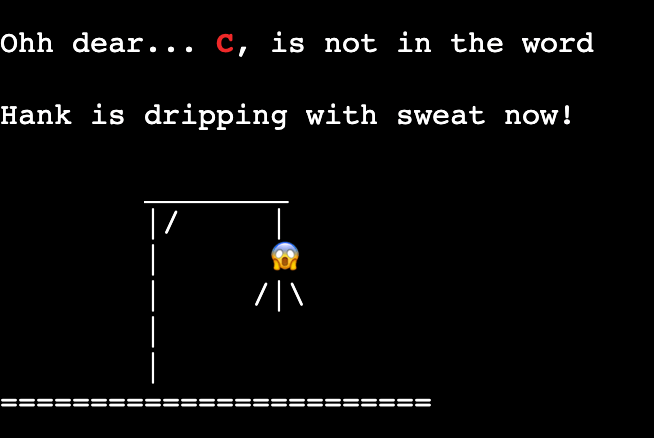 |
| Six | 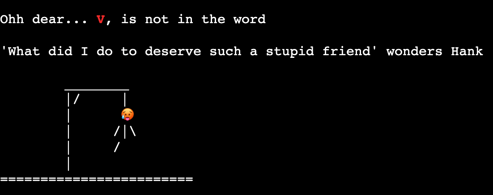 |
| Seven | 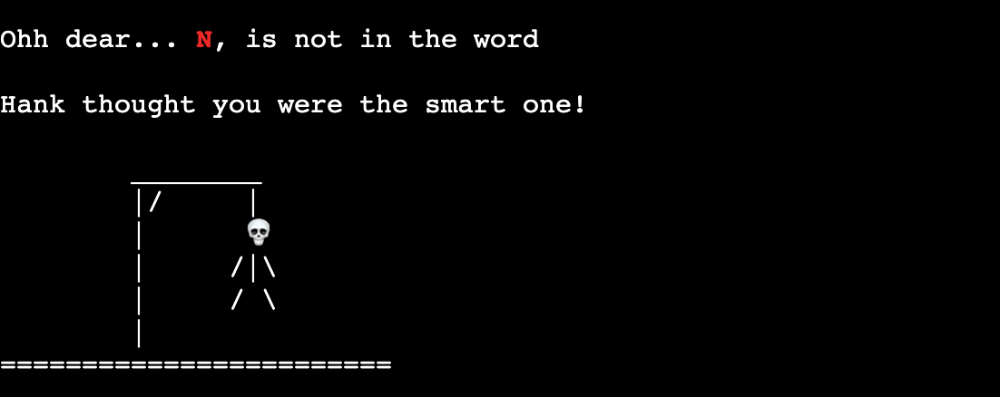 |

- **Game End**

    - When the user reaches the game end, a different statement will appear dependant on whether the user lost or won the game. If the user lost the game I have highlighted their name and in red to emphasise that they have lost, and also highlighted the correct word in green. If the user wins the game I have highlighted their name in green to portray their victory. 

| Game Lost | Game Won |
| --- | --- |
|  | 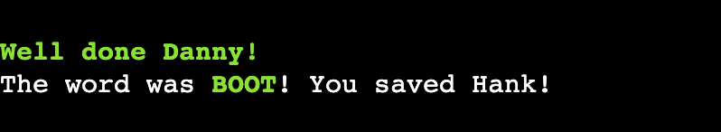 |

- **Replay Option**

    - I have added a replay question at the end of the game to ask the user if they would like to replay. I added this to enhance the users experience navigating the game and to avoid them have to restart the program manually. If the user selects that they would like to replay they will be taken back to the select difficulty page. I navigated the user here so that they would have the chance to  change the difficulty incase it was too easy or too hard previously. If the user chooses no to the replay question the game will quit.

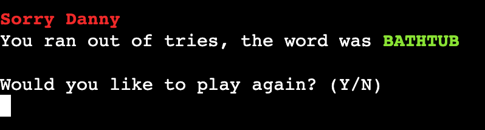

- **Quit Section**

    - With me giving the user an option to quit the game throughout various points, I made a quit section for them to be guided to. In this section I included the instructions for the user to restart the game by clicking the button about the game area. I did this so the user would have full clarity and no confusion as to how to return to the game after they had quit.

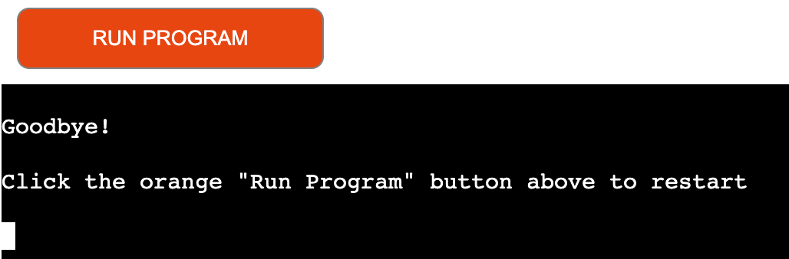

- **Invalid Statements**

    - With every input I have added, I have made sure to handle any incorrect input given by the user. To do this have made separate statements regarding inputs of an incorrect letter, an incorrect number, a special character, a space, and pressing the enter button. For each of the invalid inputs I have returned to the user what they incorrectly entered highlighted in red in the error statement. 
    - When the user enters a space or enter the invalid statement was returning a blank space for a space entry, and nothing for an enter entry. I changed this by making an if statement for each relevant validity check in my code and returning the word `Space` and `Enter` highlighted in red when the user inputs either of them. 

| Error Type | Screenshot |
| --- | --- |
| Number | 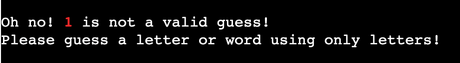 |
| Special Character |  |
| Spacebar | 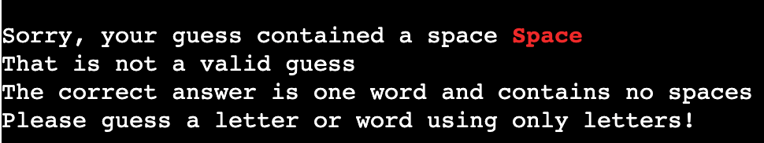 |
| Enter | 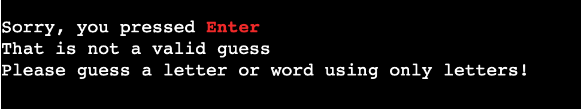 |

- **Clear Function**

    - I added a clear function to use throughout my game so as not to clutter the terminal with unnecessary code. The function is called each time the user navigates to a new section, each time they enter an invalid input, each time they guess a letter or word, and many other times. 

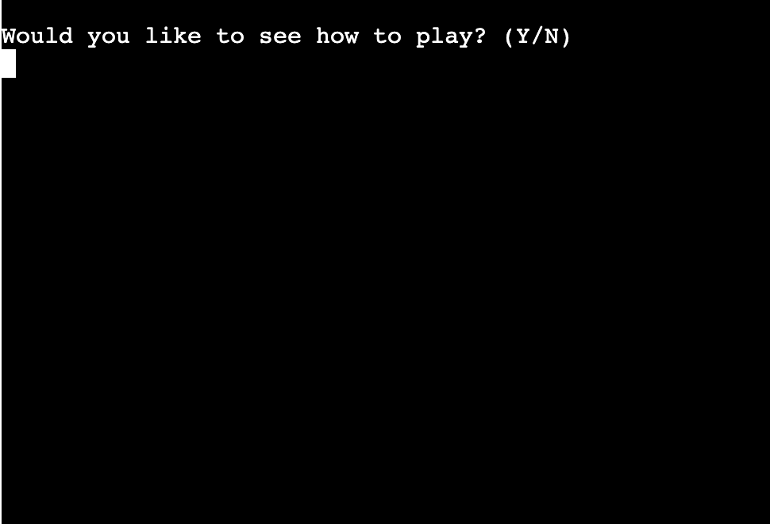

### Future Features

In the future I plan to add more features to this game. These future developments would be as follows:

- **Further Develop Hard Difficulty**
    - In future I would plan to make the hard difficulty a bit harder than it already is. I would do this by first adding a countdown timer that means the user has to think quicker to beat the clock. I would also remove the word length visual for the harder difficulty. 

- **Make Validation Function**
    - I would make one function for handling all the invalid inputs throughout the game to clean up code and avoid repetition. This function would be required to behave differently dependant on the function and input it was being called to validate. For example, it would need to display a different error message dependant on the function it is being called within. 

- **Record Users Time**
    - I would like to entice the user to challenge themselves further by recording the time it takes for them to each difficulty they play and store this data on a scoreboard. This way they will know the time they need to beat to improve and train their brain. 

- **Add Meta Description**
    -  When I ran my lighthouse report I discovered that inside the template the [Code Institute](https://www.codeinstitute.net/) provided to me that there was no meta description in the head of the HTML document. I am not aware if this was done for a purpose, or maybe just with this only being a generic template to display my python project. But in future I would find out the answer and if able to I would add meta descriptions to change the SEO score from green to amber. 

- **Fix Browser Bugs**
    - In future I would like to look further into what is causing the issues on certain browsers and devices. I would attempt to fix the problem of not being able to type in the input, and I would try to find an alternative to emojis not displaying correctly on certain browsers if there was no fix. 

## Tools & Technologies Used

Throughout this project I have used a variety of different tools and technologies. These are listed below:

- [Python](https://www.python.org/) used for the main game content.
- [Git](https://git-scm.com) used for version control. (`git add`, `git commit`, `git push`)
- [GitHub](https://github.com) used for secure online code storage.
- [Gitpod](https://gitpod.io) used as a cloud-based IDE for development.
- [Heroku](https://www.heroku.com/) used for hosting my application.
- [Chrome DevTools](https://developer.chrome.com/docs/devtools/) used to check responsive design and to run my lighthouse report. 
- [BrowserStack](https://www.browserstack.com/) used to emmulate different devices and browsers to test my website on. 
- [Am I Responsive?](https://ui.dev/amiresponsive) used to generate preview imagery of the responsive design used throughout the website.
- [Code Institue Template](https://github.com/Code-Institute-Org/p3-template)
- [Random Word Generator](https://randomwordgenerator.com/) used to generate random words.

## Data Model

### Flowchart

To follow best practice, a flowchart was created for the app's logic,
and mapped out before coding began using a free version of
[Lucidchart](https://www.lucidchart.com/).

Below is the flowchart of the main process of this Python program. It shows the entire cycle of the program.

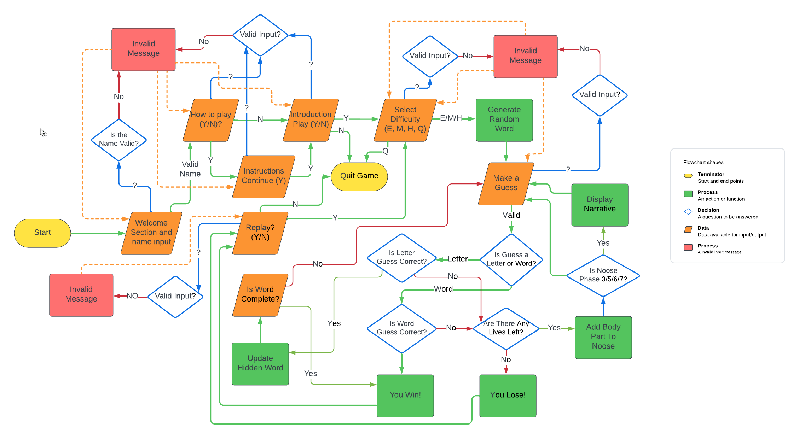

### Functions

The primary functions used on this application are:

- `clear()`
    - Clear function to clean-up the terminal.
    Function checks the users operating system to
    use the correct method to clear the terminal.
- `get_word()`
    - Function to return random word, taking
    a parameter of game difficulty chosen.
- `run_story()`
    - Function to display relevant section
    of story narrative.
- `run_hangman_story()`
    - Function to display random narratives to user
    at different points in game.
- `select_difficulty()`
    - Function for user to choose a difficulty,
    which will return the array of words
    for the difficulty chosen.
- `how_to_play()`
    - Function to display instructions to the user,
    and to validate user input.
- `welcome()`
    - Function to handle the start of the game,
    and to pass the user the choice of difficulty.
    This will return the array that was previously
    selected by the user in the select_difficulty
    function.
- `display_word()`
    - Function to loop through each letter in
    the word and show each letter that has been
    correctly guessed by the user, and to
    hide all other letters, function will
    then return the word.
- `play()`
    - Main function to play the game.
    Has an input to take the guess from the user
    which is then validated and stored in a variable.
    Other functions are then called to handle the
    users guess, and checks the users input is valid.
- `letter_guess()`
    - Function to handle when the user guesses a word.
    Checks for duplicate inputs.
    Uses colorama to display feedback to the user in the relevant
    colour dependant if the input is correct or not.
- `word_guess()`
    - Function to handle when the user guesses a word.
    Checks for duplicate inputs.
    Uses colorama to display feedback to the user in the relevant
    colour dependant if the input is correct or not.
- `update_word()`
    - Function to update the game word,
    replaces the underscores with the letter
    if the letter is correct.
    Code borrowed from Youtube tutorial:
    https://www.youtube.com/watch?v=m4nEnsavl6w
- `game_end()`
    - Function to handle the end of the game.
    Displays message to the user to let them know
    if they won or failed.
    Return message uses colorama to change the name
    and word the relevant colour depending on the outcome.
- `replay()`
    - Function to handle replaying the game,
    changing the difficulty should the user choose to,
    and checking the users input is valid
- `display_hangman()`
    - Function to display hangman phases.
    Also removes indent from hangman graphic.
- `main()`
    - Main function to run the game.

### Imports

I've used the following Python packages and/or external imported packages.

- `random`: Used to get a random choice from a list.
- `textwrap`: Used to correctly indent my hangman graphic.
- `os`: Used for adding a `clear()` function.
- `colorama`: Used for including color in the terminal.
- `from colorama import Fore, Style`: To import specific requirements from colorama. Both import lines are needed for colorama to function correctly.

## Testing

For all testing, please refer to the [TESTING.md](TESTING.md) file.

