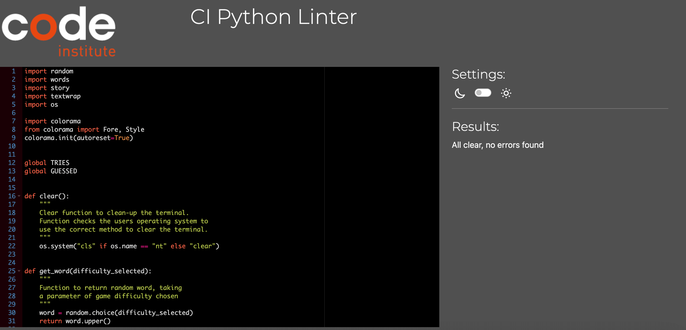
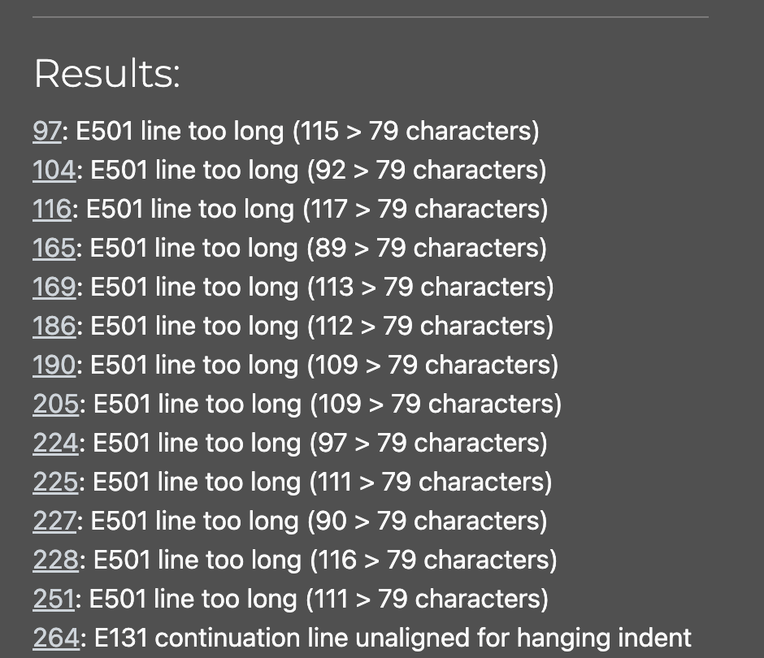
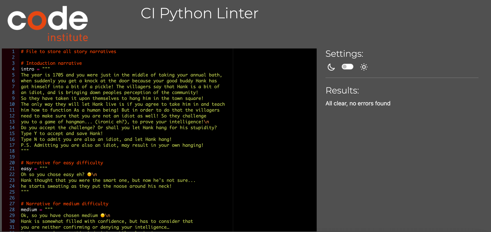
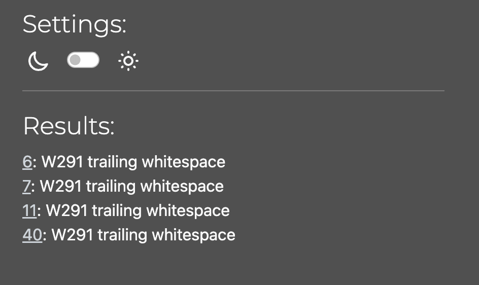
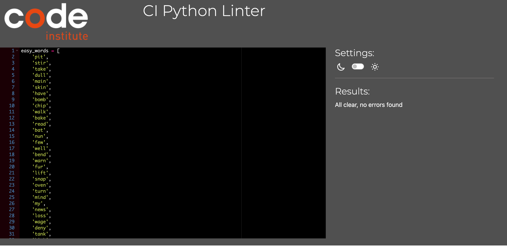
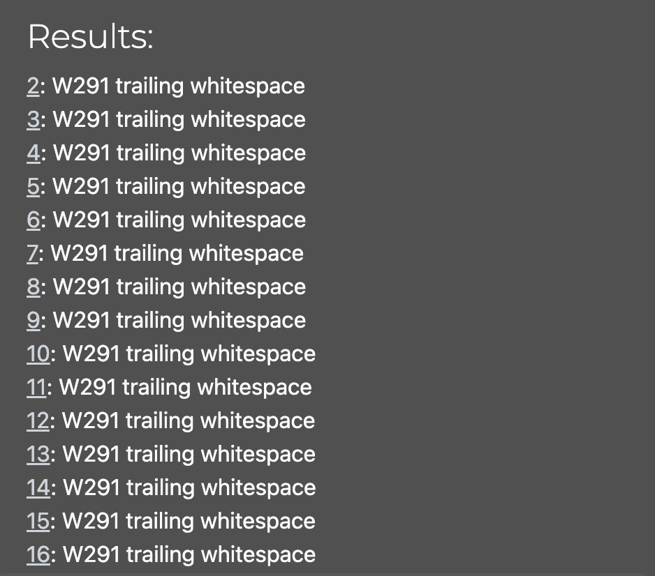

# Testing

Return back to the [README.md](README.md) file.

## Code Validation

### Python

I have used the recommended [PEP8 CI Python Linter](https://pep8ci.herokuapp.com) to validate all of my Python files.

| File | CI URL | Passed Screenshot | Errors Screenshot | Notes |
| --- | --- | --- | --- | --- |
| run.py | [PEP8 CI](https://pep8ci.herokuapp.com/https://raw.githubusercontent.com/lunartechfreek/hank-the-hanging-man/main/run.py) |  |  | Passed: Fixed all errors |
| story.py | [PEP8 CI](https://pep8ci.herokuapp.com/https://raw.githubusercontent.com/lunartechfreek/hank-the-hanging-man/main/story.py) |  |  | Passed: Fixed all errors |
| words.py | [PEP8 CI](https://pep8ci.herokuapp.com/https://raw.githubusercontent.com/lunartechfreek/hank-the-hanging-man/main/words.py) |  |  | Passed: Fixed all errors |

## Browser Compatibility

I've tested my deployed project on multiple browsers to check for compatibility issues.

### Desktop

| Operating System | Browser | Screenshot | Notes |
| --- | --- | --- | --- |
| x | x |  | x |

### Mobile

| Operating System | Browser | Screenshot | Notes |
| --- | --- | --- | --- |
| x | x |  | x |

### Tablet

| Operating System | Browser | Screenshot | Notes |
| --- | --- | --- | --- |
| x | x |  | x |

