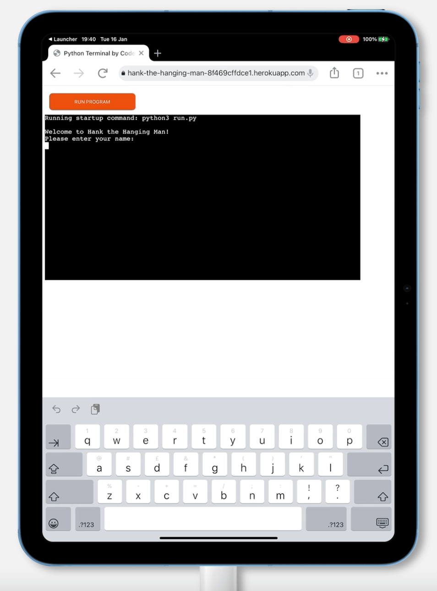

# Testing

Return back to the [README.md](README.md) file.

## Code Validation

### Python

I have used the recommended [PEP8 CI Python Linter](https://pep8ci.herokuapp.com) to validate all of my Python files.

| File | CI URL | Passed Screenshot | Errors Screenshot | Notes |
| --- | --- | --- | --- | --- |
| run.py | [PEP8 CI](https://pep8ci.herokuapp.com/https://raw.githubusercontent.com/lunartechfreek/hank-the-hanging-man/main/run.py) |  |  | Passed: Fixed all errors |
| story.py | [PEP8 CI](https://pep8ci.herokuapp.com/https://raw.githubusercontent.com/lunartechfreek/hank-the-hanging-man/main/story.py) |  |  | Passed: Fixed all errors |
| words.py | [PEP8 CI](https://pep8ci.herokuapp.com/https://raw.githubusercontent.com/lunartechfreek/hank-the-hanging-man/main/words.py) |  |  | Passed: Fixed all errors |

## Manual Testing 

### Browser Compatibility

I've tested my deployed project on multiple browsers to check for compatibility issues. To make this as thorough as possible I tested the browsers on a variety of operating systems and devices.

As well as testing on real world devices I wanted to test on other devices that I could not access. For this i used [BrowserStack](https://www.browserstack.com/).

#### Desktop

| Browser | macOS | Windows 11 | Notes |
| --- | --- | --- | --- |
| Chrome |  |  | No issues encountered |
| Edge |  |  | No issues encountered |
| Firefox |  |  | Bug: When displaying an emoji, it splits it in half |
| Opera |  |  | No issues encountered |
| Safari |  |  | macOS: Can not type in terminal. Windows11: Can not show page (very old browser v5.1) |
| Yandex | N/A |  | Bug: Emoji not displaying |

#### Mobile

With the application being deployed on [Heroku](https://www.heroku.com/) in a terminal designed by the [Code Institute](https://www.codeinstitute.net/) there are some issues with how the game is displayed on mobile screens. For the purpose of this section I have disregarded these issues and focused on how the game itself behaves on different devices and different browsers.

| Device | Browser | Screenshot | Notes |
| --- | --- | --- | --- |
| Samsung Galaxy s23 | Chrome |  | No issues encountered |
| Iphone 14 Pro | Safari |  | Bug: Not able to type so not able to play game |
| Iphone 15 plus | Chrome |  | Bug: Input not displaying so not able to play game |
| Oneplus 11R | Chrome |  | No issues encountered |
| Google Pixel 8 | Edge |  | No issues encountered |

#### Tablet

| Device | Browser | Screenshot | Notes |
| --- | --- | --- | --- |
| Samsung Galaxy Tab 9 | Chrome |  | No issues encountered |
| Samsung Galaxy Tab 9 | Edge |  | No issues encountered |
| Ipad 10th Gen | Chrome |  | Bug: Unable to type, not able to play game |
| Ipad 10th Gen | Safari |  | Bug: When displaying an emoji, it splits it in half |

### Responsiveness

I've tested my deployed project on multiple devices to check for responsiveness issues.

| Device | Test Type | Screenshot | Notes |
| --- | --- | --- | --- |
| Macbook Pro | Physical |  | No issues |
| Iphone 15 ProMax | Physical |  |  |
| Iphone 14 Plus | Physical |  |  |
|  |  |  |  |
| Desktop | Virtual |  | No issues |
| Galaxy S23 | Virtual |  | Content does not fit screen |
| Oneplus 11R | Virtual |  | Content does not fit screen |
| Pixel 8 | Virtual |  | Content does not fit screen |
| Galaxy Tab 9 | Virtual |  | No issues |
| Ipad 10th Gen | Virtual |  | No issues |
| Galaxy Fold | Devtools |  | Content does not fit screen |
| Galaxy Surface Duo | Devtools |  | Content does not fit screen |
| Galaxy Surface Pro | Devtools |  | Content does not fit screen |

## Lighthouse Audit

I've tested my deployed project using the Lighthouse Audit tool to check for any major issues.

| Page | Desktop | Mobile |
| --- | --- | --- |
| Home |  |  |

### Notable Errors

After running my lighthouse report there was only one notable error. This was on the desktop report under the SEO section. The error was regarding the template provided to me by the [Code Institute](https://www.codeinstitute.net/). In the layout.html file there was no meta description in the head of the document summarising the content of the page. This would be added as a future development to change the SEO score from amber to green.

