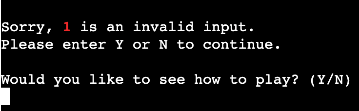

# Testing

Return back to the [README.md](README.md) file.

## Code Validation

### Python

I have used the recommended [PEP8 CI Python Linter](https://pep8ci.herokuapp.com) to validate all of my Python files.

| File | CI URL | Passed Screenshot | Errors Screenshot | Notes |
| --- | --- | --- | --- | --- |
| run.py | [PEP8 CI](https://pep8ci.herokuapp.com/https://raw.githubusercontent.com/lunartechfreek/hank-the-hanging-man/main/run.py) |  |  | Passed: Fixed all errors |
| story.py | [PEP8 CI](https://pep8ci.herokuapp.com/https://raw.githubusercontent.com/lunartechfreek/hank-the-hanging-man/main/story.py) |  |  | Passed: Fixed all errors |
| words.py | [PEP8 CI](https://pep8ci.herokuapp.com/https://raw.githubusercontent.com/lunartechfreek/hank-the-hanging-man/main/words.py) |  |  | Passed: Fixed all errors |

## Manual Testing 

### Browser Compatibility

I've tested my deployed project on multiple browsers to check for compatibility issues. To make this as thorough as possible I tested the browsers on a variety of operating systems and devices.

As well as testing on real world devices I wanted to test on other devices that I could not access. For this i used [BrowserStack](https://www.browserstack.com/).

#### Desktop

| Browser | macOS | Windows 11 | Notes |
| --- | --- | --- | --- |
| Chrome |  |  | No issues encountered |
| Edge |  |  | No issues encountered |
| Firefox |  |  | Bug: When displaying an emoji, it splits it in half |
| Opera |  |  | No issues encountered |
| Safari |  |  | macOS: Can not type in terminal. Windows11: Can not show page (very old browser v5.1) |
| Yandex | N/A |  | Bug: Emoji not displaying |

#### Mobile

With the application being deployed on [Heroku](https://www.heroku.com/) in a terminal designed by the [Code Institute](https://www.codeinstitute.net/) there are some issues with how the game is displayed on mobile screens. For the purpose of this section I have disregarded these issues and focused on how the game itself behaves on different devices and different browsers.

| Device | Browser | Screenshot | Notes |
| --- | --- | --- | --- |
| Samsung Galaxy s23 | Chrome |  | No issues encountered |
| Iphone 14 Pro | Safari |  | Bug: Not able to type so not able to play game |
| Iphone 15 plus | Chrome |  | Bug: Input not displaying so not able to play game |
| Oneplus 11R | Chrome |  | No issues encountered |
| Google Pixel 8 | Edge |  | No issues encountered |

#### Tablet

| Device | Browser | Screenshot | Notes |
| --- | --- | --- | --- |
| Samsung Galaxy Tab 9 | Chrome |  | No issues encountered |
| Samsung Galaxy Tab 9 | Edge |  | No issues encountered |
| Ipad 10th Gen | Chrome |  | Bug: Unable to type, not able to play game |
| Ipad 10th Gen | Safari |  | Bug: When displaying an emoji, it splits it in half |

### Responsiveness

I've tested my deployed project on multiple devices to check for responsiveness issues.

| Device | Test Type | Screenshot | Notes |
| --- | --- | --- | --- |
| Macbook Pro | Physical |  | No issues |
| Iphone 15 ProMax | Physical |  | Content does not fit screen |
| Desktop | Virtual |  | No issues |
| Galaxy S23 | Virtual |  | Content does not fit screen |
| Oneplus 11R | Virtual |  | Content does not fit screen |
| Pixel 8 | Virtual |  | Content does not fit screen |
| Galaxy Tab 9 | Virtual |  | No issues |
| Ipad 10th Gen | Virtual |  | No issues |
| Galaxy Fold | Devtools |  | Content does not fit screen |
| Galaxy Surface Duo | Devtools |  | Content does not fit screen |
| Galaxy Surface Pro | Devtools |  | Content does not fit screen |

## Lighthouse Audit

I've tested my deployed project using the Lighthouse Audit tool to check for any major issues.

| Page | Desktop | Mobile |
| --- | --- | --- |
| Home |  |  |

### Notable Errors

After running my lighthouse report there was only one notable error. This was on the desktop report under the SEO section. The error was regarding the template provided to me by the [Code Institute](https://www.codeinstitute.net/). In the layout.html file there was no meta description in the head of the document summarising the content of the page. This would be added as a future development to change the SEO score from amber to green.

## Defensive Programming

Defensive programming was manually tested with the below user acceptance testing:

| Feature | Expectation | Test | Result | Screenshot |
| --- | --- | --- | --- | --- |
| Game Start |  |  |  |  |
|  | Game loaded on page load | Load webpage application is hosted on | Passed: Game loaded |  |
| Name Input |  |  |  |  |
|  | If a valid name is entered, how to play will be displayed | Enter valid name | Passed: How to play displayed |  |
|  | If a number is entered, invalid entry message will display and return the number entered | Type number | Passed: Invalid message displayed |  |
|  | If a special character is entered, invalid entry message will display and return the character entered | Type special character | Passed: Invalid message displayed |  |
|  | If a space is entered, invalid entry message will display and return spacebar was pressed | Press spacebar | Passed: Invalid message displayed |  |
|  | If the user presses enter, invalid entry message will display and return enter was pressed | Press enter | Passed: Invalid message displayed |  |
| How To Play |  |  |  |  |
|  | If 'Y' is entered on how to play input, the instructions will be displayed | Enter 'Y' | Passed: Instructions displayed |  |
|  | If 'N' is entered on how to play input, the introduction will be displayed | Enter 'N' | Passed: Introduction displayed |  |
|  | If an incorrect letter is entered, invalid entry message will display and return the letter entered | Type incorrect letter | Passed: Invalid message displayed |  |
|  | If a number is entered, invalid entry message will display and return the number entered | Type number | Passed: Invalid message displayed |  |
|  | If a special character is entered, invalid entry message will display and return the character entered | Type special character | Passed: Invalid message displayed |  |
|  | If a space is entered, invalid entry message will display and return spacebar was pressed | Press spacebar | Passed: Invalid message displayed |  |
|  | If the user presses enter, invalid entry message will display and return enter was pressed | Press enter | Passed: Invalid message displayed |  |
| Instructions |  |  |  |  |
|  | If 'Y' is entered on instructions input, the introduction will be displayed | Enter 'Y' | Passed: Introduction displayed |  |
|  | If an incorrect letter is entered, invalid entry message will display and return the letter entered | Type incorrect letter | Passed: Invalid message displayed |  |
|  | If a number is entered, invalid entry message will display and return the number entered | Type number | Passed: Invalid message displayed |  |
|  | If a special character is entered, invalid entry message will display and return the character entered | Type special character | Passed: Invalid message displayed |  |
|  | If a space is entered, invalid entry message will display and return spacebar was pressed | Press spacebar | Passed: Invalid message displayed |  |
|  | If the user presses enter, invalid entry message will display and return enter was pressed | Press enter | Passed: Invalid message displayed |  |
| Introduction |  |  |  |  |
|  | If 'Y' is entered on introduction input, the select difficulty will be displayed | Enter 'Y' | Passed: Select difficulty displayed |  |
|  | If 'N' is entered on introduction input, the application will quit | Enter 'N' | Passed: Goodbye message displayed |  |
|  | If an incorrect letter is entered, invalid entry message will display and return the letter entered | Type incorrect letter | Passed: Invalid message displayed |  |
|  | If a number is entered, invalid entry message will display and return the number entered | Type number | Passed: Invalid message displayed |  |
|  | If a special character is entered, invalid entry message will display and return the character entered | Type special character | Passed: Invalid message displayed |  |
|  | If a space is entered, invalid entry message will display and return spacebar was pressed | Press spacebar | Passed: Invalid message displayed |  |
|  | If the user presses enter, invalid entry message will display and return enter was pressed | Press enter | Passed: Invalid message displayed |  |
| Select Difficulty |  |  |  |  |
|  | If 'E' is entered on select difficulty input, game starts with easy difficulty | Enter 'Y' | Passed: Easy difficulty displayed |  |
|  | If 'M' is entered on select difficulty input, game starts with medium difficulty | Enter 'N' | Passed: Medium difficulty displayed |  |
|  | If 'H' is entered on select difficulty input, game starts with hard difficulty | Enter 'Y' | Passed: Hard difficulty displayed |  |
|  | If 'Q' is entered on select difficulty input, the application will quit | Enter 'Q' | Passed: Goodbye message displayed |  |
|  | If an incorrect letter is entered, invalid entry message will display and return the letter entered | Type incorrect letter | Passed: Invalid message displayed |  |
|  | If a number is entered, invalid entry message will display and return the number entered | Type number | Passed: Invalid message displayed |  |
|  | If a special character is entered, invalid entry message will display and return the character entered | Type special character | Passed: Invalid message displayed |  |
|  | If a space is entered, invalid entry message will display and return spacebar was pressed | Press spacebar | Passed: Invalid message displayed |  |
|  | If the user presses enter, invalid entry message will display and return enter was pressed | Press enter | Passed: Invalid message displayed |  |
| Game |  |  |  |  |
|  | If a letter is entered on game input, the letter appears in 'Guessed letters' | Guess letter | Passed: Letter in 'Guessed letters' |  |
|  | If a correct letter is entered on game input, a well done message is displayed | Guess correct letter | Passed: Well done displayed |  |
|  | If an incorrect letter is entered on game input, an incorrect message is displayed and hangman image updated | Guess incorrect letter | Passed: Incorrect message displayed and hangman image updated |  |
|  | If a correct word is entered on game input, a well done message is displayed and replay question appears | Guess correct word | Passed: Well done and replay question displayed |  |
|  | If an incorrect word is entered on game input, an incorrect message is displayed and hangman image updated | Guess incorrect word | Passed: Incorrect message displayed and hangman image updated |  |
|  | If an incorrect length word is entered on game input while playing on easy, an incorrect length message is displayed and no lives lost | Guess incorrect length word | Passed: Incorrect length message displayed and prompt of letter length |  |
|  | If an incorrect length word is entered on game input while playing on medium, an incorrect message is displayed and hangman image updated | Guess incorrect length word | Passed: Incorrect message displayed and hangman image updated |  |
|  | If an incorrect length word is entered on game input while playing on hard, an incorrect message is displayed and hangman image updated | Guess incorrect length word | Passed: Incorrect message displayed and hangman image updated |  |
|  | If a number is entered, invalid entry message will display and return the number entered | Type number | Passed: Invalid message displayed |  |
|  | If a special character is entered, invalid entry message will display and return the character entered | Type special character | Passed: Invalid message displayed |  |
|  | If a space is entered, invalid entry message will display and return spacebar was pressed | Press spacebar | Passed: Invalid message displayed |  |
|  | If the user presses enter, invalid entry message will display and return enter was pressed | Press enter | Passed: Invalid message displayed |  |
| Game End |  |  |  |  |
|  | If 'Y' is entered on game end input, the game will restart and select difficulty will be displayed | Enter 'Y' | Passed: Select difficulty displayed |  |
|  | If 'N' is entered on game end input, the game will quit and goodbye message will be displayed | Enter 'N' | Passed: Goodbye message displayed |  |
|  | If an incorrect letter is entered, invalid entry message will display and return the letter entered | Type incorrect letter | Passed: Invalid message displayed |  |
|  | If a number is entered, invalid entry message will display and return the number entered | Type number | Passed: Invalid message displayed |  |
|  | If a special character is entered, invalid entry message will display and return the character entered | Type special character | Passed: Invalid message displayed |  |
|  | If a space is entered, invalid entry message will display and return spacebar was pressed | Press spacebar | Passed: Invalid message displayed |  |
|  | If the user presses enter, invalid entry message will display and return enter was pressed | Press enter | Passed: Invalid message displayed |  |

## Bugs

I encountered many bugs throughout my project, the most notable ones are as follows:

- Hangman image displaying incorrectly.

    

    - To fix this I added an extra `\` to the arm and leg so that the program would read it as a literal backslash and not as an escape character. I found this fix to my bug on [Chat GPT](https://chat.openai.com/).

- If a correct letter was guessed by the user, it was not replacing the `_` with the letter and its position inside the hidden game word.

    

    - To fix this I adjusted my `letter_guess()` function by first assigning the `update_word()` function to the `word_completion` variable rather than just calling the `update_word()` function. And then finally returning the result of the `update_word()` function.

- If an incorrect letter was guessed by the user the hangman image was not updating.  

    

    - To fix this I by changed the variable `tries` to a global variable. This was needed to be done because the value of `tries` was being modified inside a function that it was not declared in so needed to be changed to a global scope. 

- When the correct word was guessed it did not end the game and congratulate the user for winning. 

    
    

    - To fix this I changed the variable `guessed` to a global variable. This was needed to be done because the value of `guessed` was being modified inside a function that it was not declared in so needed to be changed to a global scope to update the value to true when the word was correctly guessed, and run the `game_end()` function. 

- When the user guessed a word that was a different length to the word it was showing an invalid entry error. 

    

    - To fix this I changed the if statement to stop checking if the guess length was equal to the word length,  and instead check that the length of the guess was over one. I then went further into this and changed my `word_guess()` function to check if the game was being played in easy mode. If it was then the user would receive an error message saying that the guess was the wrong length. I did this to make easy mode slightly easier. If the user was playing medium or hard mode then the user would lose a life if the word guess was incorrect regardless of the length. 

## Unfixed Bugs

- The first unfixed bug that I know of is regarding the responsiveness tests on mobile devices. The terminal provided does not fit the screen correctly. This is a known issue with the [Code Institute](https://www.codeinstitute.net/) template that I am required to use for this project.

    - | Galaxy Fold | Galaxy S23 | Oneplus 11R
      | --- | --- | --- |
      |  |  | |

- The second unfixed bug was found during my browser testing. This was that the program did not run correctly on Safari because you could not enter anything into the first input. Without the use of the input feature, this game would be unplayable on this browser. This bug is again a known issue with the template provided by the [Code Institute](https://www.codeinstitute.net/).

    - 

- The third unfixed bug I found was that emojis do not display correctly on some browsers. The two I found on desktop browsers are Firefox and Yondex. On Firefox it only shows half the emoji, and on Yondex it replaces it with a 0. Interestingly the iPad 10th Gen on safari also shows only half the emoji but all other macOS and iOS products do not have this exact issue. 

- | Firefox | Yandex | Safari (iPad)
  | --- | --- | --- |
  |  |  |  |

There are no remaining bugs that I am aware of.
